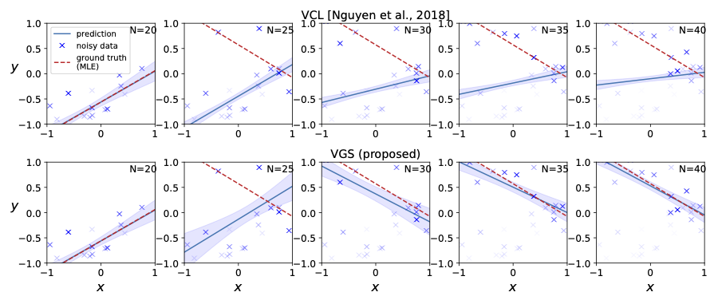
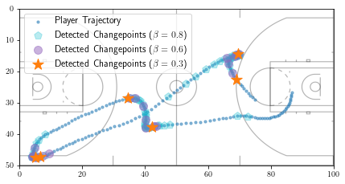
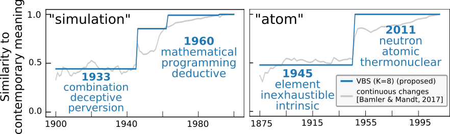

# Detecting and Adapting to Irregular Distribution Shifts in Bayesian Online Learning

Code repository of NeurIPS 2021 paper [Detecting and Adapting to Irregular Distribution Shifts in Bayesian Online Learning](https://proceedings.neurips.cc/paper/2021/hash/362387494f6be6613daea643a7706a42-Abstract.html).

Package requirements are listed in `requirements.txt`. Run 
`
pip install -r requirements.txt
`
to install all packages. 

Note that only [bayesian_deep_learning](https://github.com/mandt-lab/variational-beam-search/tree/main/bayesian_deep_learning) and [dynamic_word_embedding](https://github.com/mandt-lab/variational-beam-search/tree/main/dynamic_word_embedding) experiments require tensorflow framework; the other experiments ([toy_example](https://github.com/mandt-lab/variational-beam-search/tree/main/toy_example), [catastrophic_remembering](https://github.com/mandt-lab/variational-beam-search/tree/main/catastrophic_remembering), [basketball_player_track](https://github.com/mandt-lab/variational-beam-search/tree/main/basketball_player_track), [real_data](https://github.com/mandt-lab/variational-beam-search/tree/main/real_data)) don't.

## Toy Example


```
cd toy_example
python main.py
```

Two plots toy_beam_search.pdf (Figure 2(a) in the paper) and toy_greedy_search.pdf will be generated in the local folder. 

## Catastrophic Remebering Visualization



To visualize the catastrophic remembering effect in ordinary Bayesian Online Learning, run

```
cd catastrophic_remembering
python main.py
```

catastrophic_remembering.pdf will be stored locally.

## Real Data

* We fixed an error in the BOCD algorithm -- correcting the order of adding new run lengths and predicting new observations. This affects all experiments but the new results do not change much.

```
cd real_data

# validation
python main.py --dataset=$1 --validation --filter=$2

# testing
python main.py --dataset=$1 --filter=$2

# $1 \in {malware, elec2, sensordrift}
# $2 \in {vbs, bocd, bf, vcl, ib}
# For example:
#   python main.py --dataset=elec2 --filter=vbs
```

Results will print out, with the numbers in Table 1 in the paper.

## Basketball Player Tracking



```
cd basketball_player_track

# validation
python main.py --validation --filter=$1

# testing
python main.py --filter=$1

# $1 \in {vbs, bocd, bf, vcl, ib}
# For example:
#   python main.py --filter=vbs
```

We also provide the visualized ablation study on VBS temperature $\beta$ (Figure 2(b) in the paper) in the notebook `./basketball_player_track/VBS_ablation_on_beta.ipynb`

## Bayesian Deep Learning

Please first download the [processed SVHN data](https://drive.google.com/file/d/1OT1LeByykuX2bZNpeWZ2WSt6K8pMuTS6/view) into `./dataset/` folder.

* To run Variational Beam Search experiment, follow the commands below:

```
cd bayesian_deep_learning

# if doing validation: add option --validation 
# otherwise performing testing
python vbs.py --dataset=$1 --beam_size=$2

# $1 \in {svhn, cifar10}
# $2 > 0, usually {1, 3, 6}

# To speedup the training, use multiple gpus where each gpu realizes one hypothesis.
# For example, nvidia-smi shows cuda devices 0-5 are available, then the following command takes the same time as vcl for training vbs..
#   python vbs.py --dataset=$1 --beam_size=3 --first_gpu=0 --num_gpu=6
```

* To run Variational Continual Learning and Bayesian Independent Batch baselines, follow the commands below:

```
cd bayesian_deep_learning

# if doing validation: add option --validation 
# otherwise performing testing
python runscript_vcl.py --dataset=$1

# $1 \in {svhn, cifar10}

# to perform Bayesian independent batch baseline, add option --independent
python runscript_vcl.py --dataset=$1 --independent

# stdout is directed to the result folder
```

* To run Laplace Propagation and Independent Batch baselines, follow the commands below:

```
cd bayesian_deep_learning

# if doing validation: add option --validation 
# otherwise performing testing
python runscript_vcl.py --dataset=$1

# $1 \in {svhn, cifar10}

# to perform independent batch baseline, add option --independent
python runscript_vcl.py --dataset=$1 --independent

# stdout is directed to the result folder
```

* To run Bayesian Online Changepoint Detection baseline, follow the commands below:

```
cd bayesian_deep_learning

# if doing validation: add option --validation 
# otherwise performing testing
python bocd.py --dataset=$1 --prune_k=$2

# $1 \in {svhn, cifar10}
# $2 > 0, usually {3, 6}

# To speedup the training, use multiple gpus where each gpu realizes one hypothesis.
# For example, nvidia-smi shows cuda devices 0-6 are available, then the following command takes the same time as vcl for training vbs..
#   python bocd.py --dataset=$1 --prune_k=6 --first_gpu=0 --num_gpu=6
```

- To run Bayesian Forgetting baseline, follow the commands below:

```
d bayesian_deep_learning

# if doing validation: add option --validation 
# otherwise performing testing
python runscript_bf.py --dataset=$1

# $1 \in {svhn, cifar10}

# stdout is directed to the result folder
```

## Unsupervised Learning



### Training

We provide [pre-trained word embeddings and a demonstration notebook](#pre-trained-embeddings-and-demonstrations) to play with, e.g., find word meaning changepoints and find words with similar meanings at different time. If you want to re-train a model from scratch, please refer to the following steps.

To train the model from scratch, first download the pre-processed datasets and the pre-trained context embeddings to the corresponding `./dynamic_word_embeddings/data_n_ckpt/` folder. Then follow the commands below to run our model on different datasets. Note you may want to 1) set different beam sizes and GPU numbers in the script as you need; and 2) specify the data path and context embeddings in the script.

```
cd dynamic_word_embeddings

# Google Books
python local_jump_dsg_beam_search_gbooks.py

# Congressional Records
python local_jump_dsg_beam_search_crecords.py

# UN Debates
python local_jump_dsg_beam_search_undebates.py
```

**Datasets**:

All our pre-processed text data is available online. Download as you need and put them into the corresponding data folder. The binary file can be read by our data loader in `./dynamic_word_embeddings/lib/dataset.py`.

* [Google Books dataset](https://drive.google.com/drive/folders/11hq9M3iBBrWHsiKTl7EbHkrAUIF4TTy_?usp=sharing)

* [UN Debates dataset](https://drive.google.com/drive/folders/1jqpt-bfUgcE5sYrfWdPV6qezsm1TI56Q?usp=sharing)

* [Congressional Records dataset](https://drive.google.com/drive/folders/1Th6jEewBH_60ZT5ulqanoTDenoObjNMN?usp=sharing)

**Context Embeddings**:

For the Bayesian Skip Gram model, we hold the context embeddings fixed during training. We pre-trained these embeddings, and they can be downloaded at the following shared folders:

* [Google Books](https://drive.google.com/drive/folders/17cJARs8ygPV4WJGIKY3VhOp1cgNnvvQj?usp=sharing)

* [UN Debates](https://drive.google.com/drive/folders/1sb4LchCbQ2k7ef5KPA51uvKdhsdgQ4e0?usp=sharing)

* [Congressional Records](https://drive.google.com/drive/folders/1a6cy86qqyoQlz4jvdK7b-9wDHvFwIA4C?usp=sharing)

### Pre-trained Embeddings and Demonstrations

We make the pre-trained dynamic word embeddings available online. These are the embeddings used to report the results in the paper (30000 vocabulary size, 8 beam size). If you want to investigate word meaning shifts over time, feel free to download the embeddings for different datasets. Note the file size is large.

- [Google Books (about 9 GB)](https://drive.google.com/drive/folders/1QaUXBkvlfN5n4V1U-vYKxQD-tk9NDNlI?usp=sharing)

- [UN Debates (about 900 MB)](https://drive.google.com/drive/folders/1T0Y-m35zL9RZr5mh8u5OSLRLuUkHFl1j?usp=sharing)

- [Congressional Records (about 6 GB)](https://drive.google.com/drive/folders/1kq2hSVD0V25MAOQA_98hpX2NocSSa3Kl?usp=sharing)

After downloading the embeddings, you can visualize the word meaning changes in the notebook `./dynamic_word_embedding/change_point_examples.ipynb`


---


```
@article{li2021vbs,
  title={Detecting and Adapting to Irregular Distribution Shifts in Bayesian Online Learning},
  author={Li, Aodong and Boyd, Alex and Smyth, Padhraic and Mandt, Stephan},
  journal={Advances in Neural Information Processing Systems},
  volume={34},
  year={2021}
}
```
